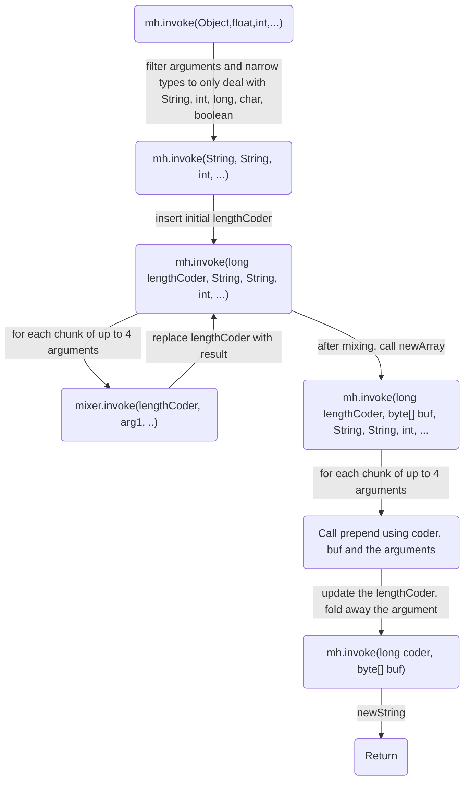
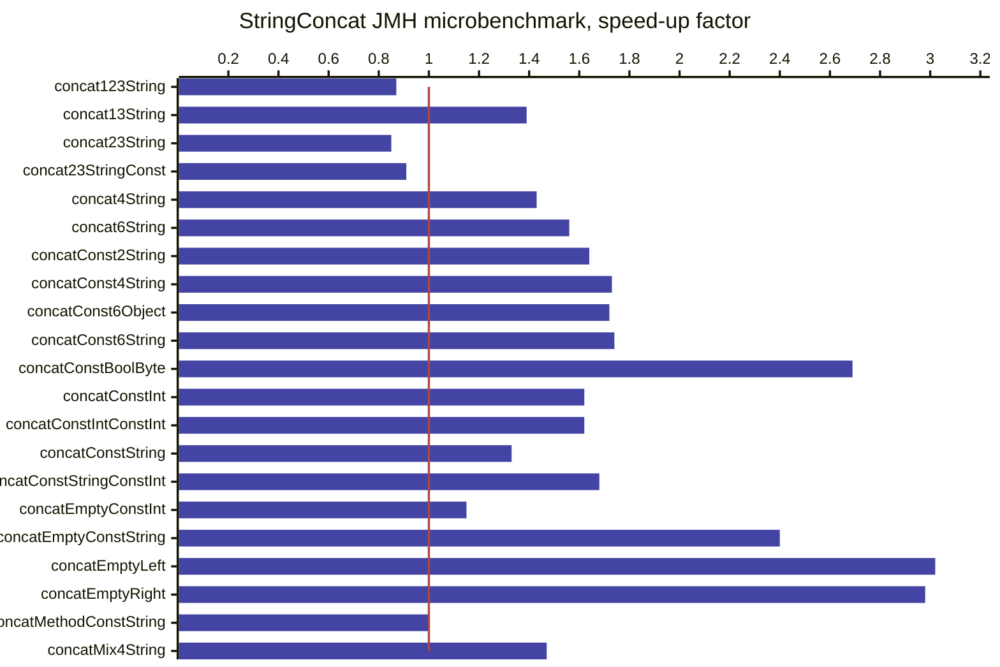

## Pitch:
JDK 9 introduced a way to dynamically decide how to concatenate `String`s through JEP 280.
This brought potential throughput improvements, but also some startup woes. In certain
situations the dynamic, `MethodHandle`-based implementation can generate scores of classes
to build up the expression tree - adding startup time and runtime footprint. These complex
expression trees may turn into a challenge for JIT compilers.
In the meantime there has been various improvements that could be leveraged. The new
ClassFile API makes spinning bytecode more convenient than ever. Hidden classes mean we
can define shareable, unloadable classes inside a privileged package, so perhaps it’s time to
rethink how to indify string concatenation with a goal of matching the performance of the
current best strategy, while generating less code and taking less time - at all levels - to get
there.
Suggested talk highlights
- Detail current issues with the String concat factory
- Lots of unused, intermediary LF classes are generated, visible in realistic cases, and possible to generate thousands of classes in stress tests
- We recently had to revert to a simple ClassFile API-based implementation for huge expressions (arity >= 20) since they could otherwise overwhelm C2. Such expressions now end up slightly less performance and with at least a single class per concat call-site.
- Touch on some past optimizations and improvements (lots of progress from 9 -> 17)
- Touch on some current but parked attempts at reducing cost of intermediary LF class spinning
- Demonstrate a more thorough rewrite using the ClassFile API, leveraging hidden classes to enable direct access to package-protected java.lang APIs. Ideally complex MH expression trees are replaced with cachable, sharable classes
- Define some tests, benchmarks, produce performance results, JEP(?)/RFE proposal, applause!

## Introduction

JDK 9 introduced a way to dynamically decide how to concatenate Strings through JEP 280.

In the words of the JEP, Indify String Concatenation changed the `String`-concatenation 
bytecode sequence generated by `javac` to use `invokedynamic` calls to JDK library functions.

## Bytecode view

Let's take a quick look at that bytecode sequence before and after JEP 280.

Take this simple "Hello $1" Java program:
```
public class StringConcat {
    public static void main(String[] args) {
        System.out.println("Hello " + args[0]);
    }
}
```

Compile for JDK 8 compatibility with `javac --release 8 StringConcat.java` then print the bytecode with `javap -v StringConcat`:

```
  public static void main(java.lang.String[]);
    descriptor: ([Ljava/lang/String;)V
    flags: (0x0009) ACC_PUBLIC, ACC_STATIC
    Code:
      stack=4, locals=1, args_size=1
         0: getstatic     #7                  // Field java/lang/System.out:Ljava/io/PrintStream;
         3: new           #13                 // class java/lang/StringBuilder
         6: dup
         7: invokespecial #15                 // Method java/lang/StringBuilder."<init>":()V
        10: ldc           #16                 // String Hello
        12: invokevirtual #18                 // Method java/lang/StringBuilder.append:(Ljava/lang/String;)Ljava/lang/StringBuilder;
        15: aload_0
        16: iconst_0
        17: aaload
        18: invokevirtual #18                 // Method java/lang/StringBuilder.append:(Ljava/lang/String;)Ljava/lang/StringBuilder;
        21: invokevirtual #22                 // Method java/lang/StringBuilder.toString:()Ljava/lang/String;
        24: invokevirtual #26                 // Method java/io/PrintStream.println:(Ljava/lang/String;)V
        27: return
      LineNumberTable:
        line 3: 0
        line 4: 27
```

Push `System.out` to stack, allocate a `StringBuilder`, append the `"Hello"` constant, append the `argv[0]`, call `toString()`
on the `StringBuilder`, call `System.out.println` with the result, return. Simple!

Now let's see the same with JEP 280. Compile with `javac StringConcat` and print the class bytecode with `javap -v StringConcat`:
```
  public static void main(java.lang.String[]);
    descriptor: ([Ljava/lang/String;)V
    flags: (0x0009) ACC_PUBLIC, ACC_STATIC
    Code:
      stack=3, locals=1, args_size=1
         0: getstatic     #7                  // Field java/lang/System.out:Ljava/io/PrintStream;
         3: aload_0
         4: iconst_0
         5: aaload
         6: invokedynamic #13,  0             // InvokeDynamic #0:makeConcatWithConstants:(Ljava/lang/String;)Ljava/lang/String;
        11: invokevirtual #17                 // Method java/io/PrintStream.println:(Ljava/lang/String;)V
        14: return
      LineNumberTable:
        line 3: 0
        line 4: 14
...
BootstrapMethods:
  0: #34 REF_invokeStatic java/lang/invoke/StringConcatFactory.makeConcatWithConstants:(Ljava/lang/invoke/MethodHandles$Lookup;Ljava/lang/String;Ljava/lang/invoke/MethodType;Ljava/lang/String;[Ljava/lang/Object;)Ljava/lang/invoke/CallSite;
    Method arguments:
      #32 Hello \u0001
```

Push `System.out` to stack, load the `argv[0]` argument, `invokedynamic!`, call `System.out.println` with the result, return.

`invokedynamic` looks like magic, but it's really just a trick: 
the first time the `invokedynamic` is executed the VM will bootstrap by making an upcall to the referenced bootstrap method - `StringConcatFactory.makeConcatWithConstants` - 
 which returns a `CallSite`. It's the job of the bootstrap method to make sure that the produced `CallSite` has a target `MethodHandle`, which will then be invoked as-if the call sequence was an `invokevirtual` with the `MethodHandle` on stack before the arguments - in this case a single `String` argument
and return a `String`.

A `MethodHandle` is an executable reference to some code which the VM natively knows how to invoke. It could be a direct reference to a method, or there can be layers of transforms of
the inputs or the return values - arguments can be filtered using other `MethodHandles`, auxiliary arguments can be added and folded in etc.
The resulting `MethodHandle` could be visualized as a syntax tree. (I've not seen a proof that the `MethodHandles` API is turing complete in isolation, but it probably is)


## StringConcatFactory.makeConcatWithConstants

Specifically, the default strategy for bootstrapping concats in `StringConcatFactory` will 
create an expression tree that combines some public methods (such as `String::valueOf`) and a few helper methods from `java.lang.StringConcatHelper`:  
```
static long initialCoder() { ... }
// T: boolean, char, int, long, String
static long mix(long lengthCoder, T value) { ... } 
static byte[] newArray(long indexCoder) { ... }
static long prepend(long lengthCoder, byte[] buf, T value) { ... } 
static String newString(byte[] buf, long indexCoder) { ... }
```

using a number of combinators and transforms from `java.lang.invoke.MethodHandles`:

```java
Class<?>[] ptypes = mt.erase().parameterArray(); 
MethodHandle mh = MethodHandles.dropArgumentsTrusted(newString(), 2, ptypes);
..
mh = filterInPrependers(mh, constants, ptypes);
..
MethodHandle newArrayCombinator = newArray();
mh = MethodHandles.foldArgumentsWithCombiner(mh, 0, newArrayCombinator,
        1 // index
);
..
mh = filterAndFoldInMixers(mh, initialLengthCoder, ptypes);
if (objFilters != null) {
  mh = MethodHandles.filterArguments(mh, 0, objFilters);
}
return mh;
```

The combinator tree is built up in reverse, making the code challenging to read. There are also a few non-public 

A flow chart of what happens when the `mh` returned is invoked:



We do have a static variant for simple concatenations of two `Object` arguments which can be used as a visualization-of-sorts
for what's going on:

```java
    static String simpleConcat(Object first, Object second) {
        // MethodHandles.filterArguments
        String s1 = stringOf(first); 
        String s2 = stringOf(second);
        ...
        // filterAndFoldInMixers:
        long indexCoder = mix(initialCoder(), s1);
        indexCoder = mix(indexCoder, s2);
        
        byte[] buf = newArray(indexCoder);
        // prepend each argument in reverse order, since we prepending
        // from the end of the byte array
        indexCoder = prepend(indexCoder, buf, s2);
        indexCoder = prepend(indexCoder, buf, s1);
        // return newString
        return newString(buf, indexCoder);
    }
```

## The `StringBuilder` fallback

As the `MethodHandle` expression tree grows we eventually ran into issues with JIT compilers taking too much time
to compile them: [JDK-8327247: C2 uses up to 2GB of RAM to compile complex string concat in extreme cases](https://bugs.openjdk.org/browse/JDK-8327247) 


As a quick and dirty fix we opted to bring back code which spins a class per concatenation for sufficiently complex expressions.

This code is not very optimized. It effectively generates code similar to what javac would, with the crucial distinction
that it's not inlined at the callsite but in a method of a class we generate on the fly.

## Performance impact

JEP 280 was obviously motivated by performance, and the ability to emit code that is easier for JIT compilers to
optimize. As such there are various benchmarks, including the `org.openjdk.bench.java.lang.StringConcat` benchmark, which
has been added to over the years. 

Let's build that with pre-JEP 280 mode, using `-XDstringConcat=inline` when building, and compare with the recent 
JDK mainline.

```
Name                                    Change
StringConcat.concat123String             0.87x (p = 0.000*)
StringConcat.concat13String              1.39x (p = 0.000*)
StringConcat.concat23String              0.85x (p = 0.000*)
StringConcat.concat23StringConst         0.91x (p = 0.000*)
StringConcat.concat4String               1.43x (p = 0.000*)
StringConcat.concat6String               1.56x (p = 0.000*)
StringConcat.concatConst2String          1.64x (p = 0.000*)
StringConcat.concatConst4String          1.73x (p = 0.000*)
StringConcat.concatConst6Object          1.72x (p = 0.000*)
StringConcat.concatConst6String          1.74x (p = 0.000*)
StringConcat.concatConstBoolByte         2.69x (p = 0.000*)
StringConcat.concatConstInt              1.62x (p = 0.000*)
StringConcat.concatConstIntConstInt      1.62x (p = 0.000*)
StringConcat.concatConstString           1.33x (p = 0.000*)
StringConcat.concatConstStringConstInt   1.68x (p = 0.000*)
StringConcat.concatEmptyConstInt         1.15x (p = 0.000*)
StringConcat.concatEmptyConstString      2.40x (p = 0.000*)
StringConcat.concatEmptyLeft             3.02x (p = 0.000*)
StringConcat.concatEmptyRight            2.98x (p = 0.000*)
StringConcat.concatMethodConstString     1.00x (p = 0.339 )
StringConcat.concatMix4String            1.47x (p = 0.000*)
```


(Linux-x64, Intel(R) Xeon(R) Platinum 8358 CPU @ 2.60GHz)

We can see that there are mostly improvements while a few cases regress. 

All the regressions are from when we fall back to spinning bytecode doing `StringBuilder` appends. The
performance cost come from a combination of outlining that code to a separate class and that that code is 
large enough that inlining it back into the caller is unlikely to happen. In practice outlining might even 
help overall performance. 

### Startup woes - past and present

The current strategy has evolved since JDK 9, mainly to address 
startup and footprint impacts.

An example of changes made was to combine the logical `int length` and `byte coder` into
a single `long lengthCoder` ([JDK-8213035](https://bugs.openjdk.org/browse/JDK-8213035)). 

This change (in JDK 12) meant that we bind fewer 
method handles into the root method handle, which leads to faster execution and fewer generated classes.
Posted results for this change alone was 10ms faster out of a total 131ms runtime on a startup test.

Further work refactored how we stringify Objects and fold constants into the prepend combinators so that even fewer shapes were 
needed. From https://cl4es.github.io/2019/05/14/String-Concat-Redux.html:

```
         Total   Overhead
JDK 8:    60ms        0ms
JDK 9:   215ms      129ms
JDK 11:  164ms      118ms 
JDK 12:  111ms       68ms
JDK 13*:  86ms       46ms
```

On one stress test we dropped the number of loaded classes from 39394 to 3174 from JDK 11 to JDK 13 alone.

Since then there's not been much targeted work to improve this, and the overhead has slus

### Sidetrack: Improving the current implementation

Some of the changes like JDK-8213035 wasn't _perfectly_ performance neutral, though. I saw some small changes on x64
back then, and when doing a comparison with a `-XDstringConcat=inline` baseline 
I saw some pretty significant _slowdowns_ on my M1. 

A few turned out to be noise but a few persisted, such as `concatMix4String`.

Investigating it turns out that we could profit from streamlining the code a bit. Taking care 
to better inline code into the helper functions. Avoid unnecessary shifts. That kind of thing:
[PR#19927](https://github.com/openjdk/jdk/pull/19927)

```
Name                            Change
StringConcat.concat13String      1.25x (p = 0.000*) // Linux x64
StringConcat.concatConst2String  1.20x (p = 0.000*)
StringConcat.concatConst4String  1.17x (p = 0.000*)
StringConcat.concatConst6String  1.17x (p = 0.000*)
StringConcat.concatMix4String    1.24x (p = 0.000*)

StringConcat.concatMix4String    1,76x (p = 0,000*) // Macbook M1
```

Some of this fixes regressions that have crept into the implementation
since inception in JDK 9. 

But this PR also demonstrates a key design benefit of JEP 280: 
Delegating to the runtime to generate code shape leaves us free to experiment and 
optimize the code without a need to recompiling the java code with a patched javac. The static bytecode 
remains unchanged.

## Lingering woes

So while things have improved since JDK 9 there is still a hefty cost of spinning up complex
concat expressions. 

That 46ms overhead number I blogged about for JDK all those years ago more or less persist on the same hardware setup.

When working on PR#19927 I realized none of the `String` concat stress tests I've experimented with were added to the 
OpenJDK, so I've added a couple of JMH:ified variants in `StringConcatStartup`. Running this stand-alone with `perf stat -r 10` 20 times and collecting the results
yields this result:

```
Name                  Cnt           Base           Error
StringConcatStartup    20        238,000 ±         6,667
  :.cycles                2432315862,050 ±  54176897,441
  :.instructions          5762516585,300 ± 129310503,641
  :.taskclock                    785,500 ±        15,806
* = significant
```

Add to this the aforementioned `StringBuilder` fallback where we opt out of the optimized concatenation for high-arity


## Leyden to the rescue!
Ioi Lam has done great work within Project Leyden to allow pre-resolving 
`String` concat expressions as produced by the `StringConcatFactory`, storing them in the Leyden AOT archive and reconstituting
the final `MethodHandle` from the archive when linking the callsite. Basically short-cutting the `StringConcatFactory` entirely:

```
Name                  Cnt           Base           Error           Test          Error         Unit  Change
StringConcatStartup    20        238,000 ±         6,667         51,500 ±        5,825        ms/op   4,62x (p = 0,000*)
  :.cycles                2432315862,050 ±  54176897,441  197078259,500 ± 14892778,793       cycles   0,08x (p = 0,000*)
  :.instructions          5762516585,300 ± 129310503,641  465665905,900 ± 36712720,885 instructions   0,08x (p = 0,000*)
  :.taskclock                    785,500 ±        15,806         57,000 ±        6,362           ms   0,07x (p = 0,000*)
  * = significant
```

This works great for anything captured in a training run. So we're done, then?

Anything not resolved during training will not be captured, however, so when encountering those callsites the runtime 
will go through the `StringConcatFactory`, potentially spinning a significant amount of classes at runtime. 

It's anyone's guess what concat callsite capture rate leyden deployments will have, so it still seems prudent to improve
on the status quo. 

Another issue with the current implementation is that it scales poorly if we want to improve on type specialization.
In the current model javac emits exactly typed invocations to the `StringConcatFactory` bootstrap method, and the returned
method handle is adapted to the exact type - even though the `MethodHandle` currently produced by the factory only cares
about (some) primitive types and `Object`. We could specialize more exactly but shy away from this since each added 
specialization exponentially increases the potential number of `LambdaForm` classes that could be generated.

## Remodeling to spin classes

This is _almost_ what the current SCF strategy would produce if we let it. One difference is
that if one of the operands is a string constant the SCF MH strategy would seed the MH expression
with the result of `mix(initialCoder(), constant)`. But for a single constant + parameter there's 
not much of a difference.

When the `StringConcatFactory` sees something which can use `simpleConcat` it either produces a `DirectMethodHandle` (two
reference args being concatenated, `foo + bar`) or inserts the constant in the right position:
```
        if (paramCount == 1) {
            String prefix = constants[0];
            if (prefix == null) {
                if (suffix == null) {
                    return unaryConcat(mt.parameterType(0));
                } else if (!mt.hasPrimitives()) {
                    return MethodHandles.insertArguments(simpleConcat(), 1, suffix);
                } // else fall-through
            } else if (suffix == null && !mt.hasPrimitives()) {
                // Non-primitive argument
                return MethodHandles.insertArguments(simpleConcat(), 0, prefix);
            } // fall-through if there's both a prefix and suffix
        }
```


The idea is to generalize. To do that we need something that will hold on to the constants,
then efficiently goes through the arguments and returns a string.

Extrapolating from `simpleConcat` and taking a generalized approach to whether there
are constants around the arguments we would end up with something like this for a concatenation taking
a String and an int:
```
    private final String c0;
    private final String c1;
    private final String c2;
    private final long initialCoder;
    GeneratedStringConcat(String[] constants) {
        long initialCoder = StringConcatHelper.initialCoder();
        c0 = constants[0];
        initialCoder = StringConcatHelper.mix(initialCoder, c0);
        c1 = constants[1];
        initialCoder = StringConcatHelper.mix(initialCoder, c1);
        c2 = constants[2];
        initialCoder = StringConcatHelper.mix(initialCoder, c2);
        this.initialCoder = initialCoder;
    }

    // Concatenates an expression "prefix" + foo + "constant" + bar + "suffix" 
    String concat(Object o0, int i1) {
        // Stringify Object, float, double args:
        String s0 = StringConcatHelper.stringOf(o0);

        long lengthCoder = initialCoder;
        lengthCoder = StringConcatHelper.mix(lengthCoder, s0);
        lengthCoder = StringConcatHelper.mix(lengthCoder, i1);

        // prepend from the end
        byte[] buf = StringConcatHelper.newArray(lengthCoder, c2);

        // prepend from the end
        lengthCoder = StringConcatHelper.prepend(lengthCoder, buf, c1, i1);
        lengthCoder = StringConcatHelper.prepend(lengthCoder, buf, c0, s0);
        return StringConcatHelper.newString(buf, lengthCoder);
    }
```

But hold on! The `long lengthCoder` hack was something we did to workaround overheads incurred 
in the MH combinator trees. That is.. by applying mixers on a `long` which encoded both the `int length` and 
`byte coder` we simplified the mixer `MethodHandles` and could reduce the number of synthetic arguments
in the expression tree. 

In a plain Java translation all that is probably just added complexity. Let's simplify!

Let `StringConcatHelper` redefine `mixer` to only deal with `length` and retain the intermediate overflow checking:
```
    static int mix(int length, String value) {
        length += value.length();
        return checkOverflow(length);
    }
    
    private static int checkOverflow(int length) {
        if (length < 0) {
            throw new OutOfMemoryError("Overflow: String length out of range");
        }
        return length;
    }
```

```
    private final String c0;
    private final String c1;
    private final String c2;
    private final int length;
    private final byte coder;
    GeneratedStringConcat(String[] constants) {
        byte coder = String.COMPACT_STRINGS ? String.LATIN1 : String.UTF16;
        int length = 0;

        c0 = constants[0];
        coder |= c0;
        length = StringConcatHelper.mix(length, c0); // check for overlow
        ...

        this length = length;
        this.coder = coder;
    }

    // Concatenates an expression "prefix" + foo + "constant" + bar + "suffix" 
    String doConcat(Object o0, int i1) {
        // Stringify Object, float, double args:
        String s0 = StringConcatHelper.stringOf(o0);
        
        // Only string(ified) args can mutate initial coder
        int coder = this.coder | s0.coder(); // we're inside java.lang, which gives access to package-private

        // Mix in lengths
        int length = this.length;
        length = StringConcatHelper.mix(length, s0);
        length = StringConcatHelper.mix(length, i1);
        
        // prepend from the end
        byte[] buf = StringConcatHelper.newArray(length, coder, c2);
                
        // prepend from the end
        length = StringConcatHelper.prepend(length, coder, buf, c1, i1);
        length = StringConcatHelper.prepend(length, coder, buf, c0, s0);
        return StringConcatHelper.newString(buf, length, coder);
    }
```

Splitting explands the code a bit more in both the constructor and the `concat` method, but not having to pack and
unpack the coder at every mixer and prepend step should make it more straightforward and easier for the compilers to 
optimize.

## Detour


