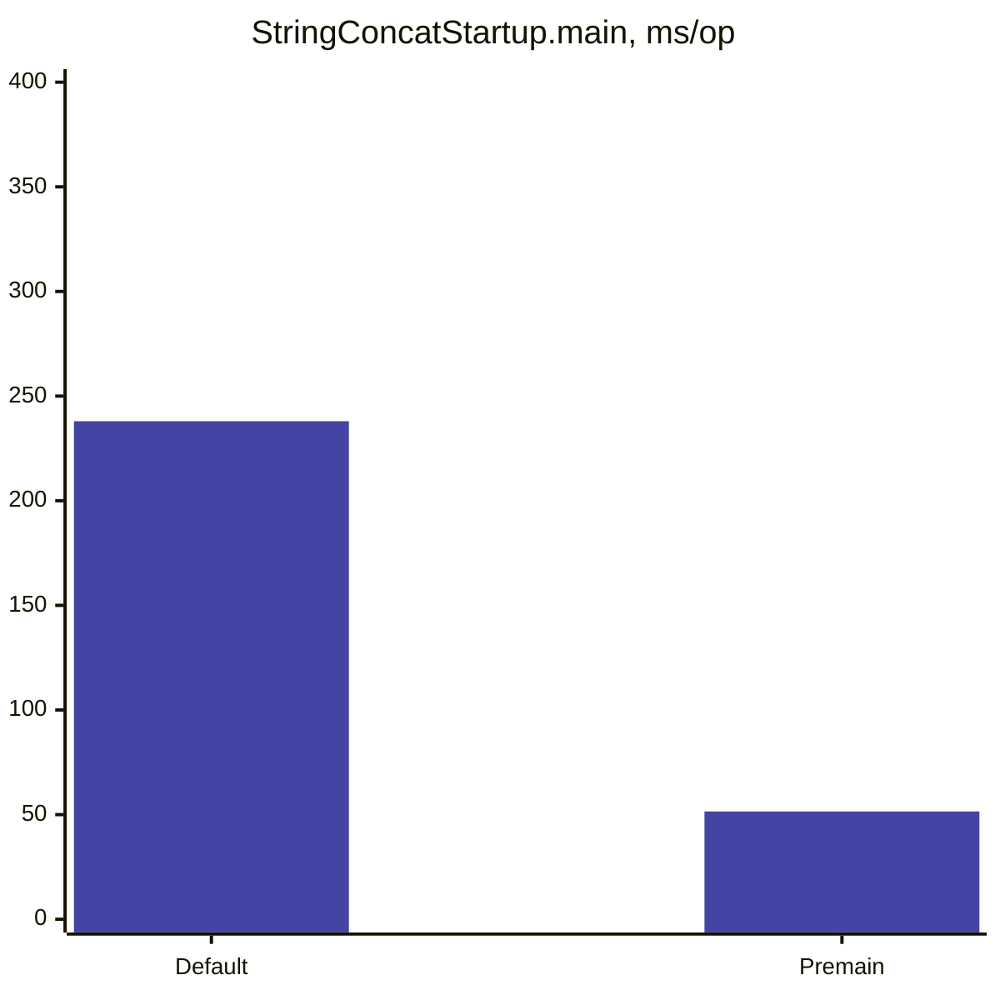
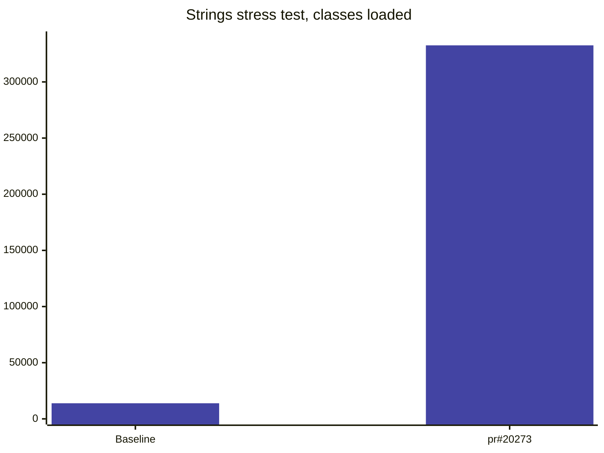
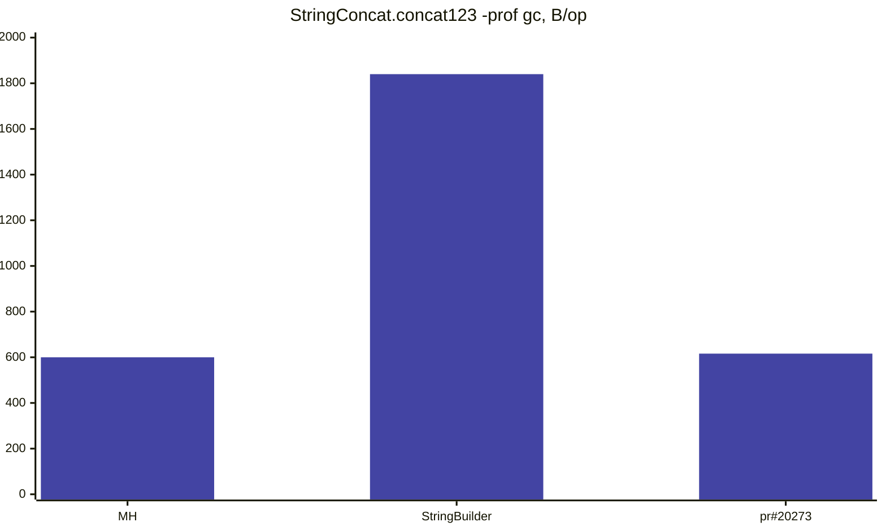
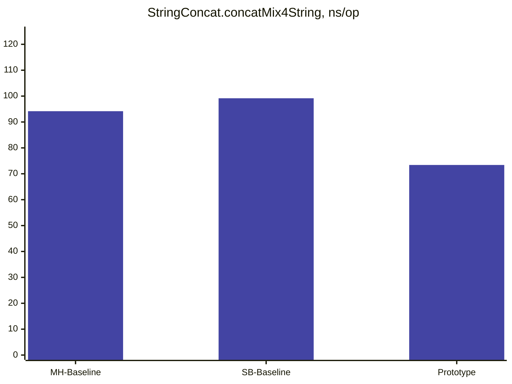

# Introduction

JDK 9 introduced a way to dynamically decide how to concatenate Strings through JEP 280.

In the words of the JEP, Indify String Concatenation changed the `String`-concatenation
bytecode sequence generated by `javac` to use `invokedynamic` calls to JDK library functions.

# Bytecode view

Let's take a quick look at that bytecode sequence before and after JEP 280.

Take this simple "Hello $1" Java program:
```
public class StringConcat {
    public static void main(String[] args) {
        System.out.println("Hello " + args[0]);
    }
}
```

# JDK 8 bytecode

Compile for JDK 8 compatibility with `javac --release 8 StringConcat.java` then print the bytecode with `javap -v StringConcat`:

```
  public static void main(java.lang.String[]);
    descriptor: ([Ljava/lang/String;)V
    flags: (0x0009) ACC_PUBLIC, ACC_STATIC
    Code:
      stack=4, locals=1, args_size=1
         0: getstatic     #7                  // Field java/lang/System.out:Ljava/io/PrintStream;
         3: new           #13                 // class java/lang/StringBuilder
         6: dup
         7: invokespecial #15                 // Method java/lang/StringBuilder."<init>":()V
        10: ldc           #16                 // String Hello
        12: invokevirtual #18                 // Method java/lang/StringBuilder.append:(Ljava/lang/String;)Ljava/lang/StringBuilder;
        15: aload_0
        16: iconst_0
        17: aaload
        18: invokevirtual #18                 // Method java/lang/StringBuilder.append:(Ljava/lang/String;)Ljava/lang/StringBuilder;
        21: invokevirtual #22                 // Method java/lang/StringBuilder.toString:()Ljava/lang/String;
        24: invokevirtual #26                 // Method java/io/PrintStream.println:(Ljava/lang/String;)V
        27: return
      LineNumberTable:
        line 3: 0
        line 4: 27
```

Push `System.out` to stack, allocate a `StringBuilder`, append the `"Hello"` constant, append the `argv[0]`, call `toString()`
on the `StringBuilder`, call `System.out.println` with the result, return. Simple!

# JDK 9 View

Now let's see the same with JEP 280. Compile with `javac StringConcat` and print the class bytecode with `javap -v StringConcat`:
```
  public static void main(java.lang.String[]);
    descriptor: ([Ljava/lang/String;)V
    flags: (0x0009) ACC_PUBLIC, ACC_STATIC
    Code:
      stack=3, locals=1, args_size=1
         0: getstatic     #7                  // Field java/lang/System.out:Ljava/io/PrintStream;
         3: aload_0
         4: iconst_0
         5: aaload
         6: invokedynamic #13,  0             // InvokeDynamic #0:makeConcatWithConstants:(Ljava/lang/String;)Ljava/lang/String;
        11: invokevirtual #17                 // Method java/io/PrintStream.println:(Ljava/lang/String;)V
        14: return
      LineNumberTable:
        line 3: 0
        line 4: 14
...
BootstrapMethods:
  0: #34 REF_invokeStatic java/lang/invoke/StringConcatFactory.makeConcatWithConstants:(Ljava/lang/invoke/MethodHandles$Lookup;Ljava/lang/String;Ljava/lang/invoke/MethodType;Ljava/lang/String;[Ljava/lang/Object;)Ljava/lang/invoke/CallSite;
    Method arguments:
      #32 Hello \u0001
```

Push `System.out` to stack, load the `argv[0]` argument, `invokedynamic!`, call `System.out.println` with the result, return.

`invokedynamic` looks like magic, but it's really just a trick:
the first time the `invokedynamic` is executed the VM will bootstrap by making an upcall to the referenced bootstrap method - `StringConcatFactory.makeConcatWithConstants` -
which returns a `CallSite`. It's the job of the bootstrap method to make sure that the produced `CallSite` has a target `MethodHandle`, which will then be invoked as-if the call sequence was an `invokevirtual` with the `MethodHandle` on stack before the arguments - in this case a single `String` argument
and return a `String`.

A `MethodHandle` is an executable reference to some code which the VM natively knows how to invoke. It could be a direct reference to a method, or there can be layers of transforms of
the inputs or the return values - arguments can be filtered using other `MethodHandles`, auxiliary arguments can be added and folded in etc.
The resulting `MethodHandle` could be visualized as a syntax tree. (I've not seen a proof that the `MethodHandles` API is turing complete in isolation, but it probably is)

# StringConcatFactory.makeConcatWithConstants

Specifically, the default strategy for bootstrapping concats in `StringConcatFactory` will
create an expression tree that combines some public methods (such as `String::valueOf`) and a few helper methods from `java.lang.StringConcatHelper`:
```
static long initialCoder() { ... }
// T: boolean, char, int, long, String
static long mix(long lengthCoder, T value) { ... } 
static byte[] newArray(long indexCoder) { ... }
static long prepend(long lengthCoder, byte[] buf, T value) { ... } 
static String newString(byte[] buf, long indexCoder) { ... }
```

using a number of combinators and transforms from `java.lang.invoke.MethodHandles`:

```java
Class<?>[] ptypes = mt.erase().parameterArray(); 
MethodHandle mh = MethodHandles.dropArgumentsTrusted(newString(), 2, ptypes);
..
mh = filterInPrependers(mh, constants, ptypes);
..
MethodHandle newArrayCombinator = newArray();
mh = MethodHandles.foldArgumentsWithCombiner(mh, 0, newArrayCombinator,
        1 // index
);
..
mh = filterAndFoldInMixers(mh, initialLengthCoder, ptypes);
if (objFilters != null) {
  mh = MethodHandles.filterArguments(mh, 0, objFilters);
}
return mh;
```

The combinator tree is built up in reverse, making the code challenging to read. There are also a few non-public

# Flow chart
A flow chart of what happens when the `mh` returned is invoked:


We do have a static variant for simple concatenations of two `Object` arguments which can be used as a visualization-of-sorts
for what's going on:

```java
    static String simpleConcat(Object first, Object second) {
        // MethodHandles.filterArguments
        String s1 = stringOf(first); 
        String s2 = stringOf(second);
        ...
        // filterAndFoldInMixers:
        long indexCoder = mix(initialCoder(), s1);
        indexCoder = mix(indexCoder, s2);
        
        byte[] buf = newArray(indexCoder);
        // prepend each argument in reverse order, since we prepending
        // from the end of the byte array
        indexCoder = prepend(indexCoder, buf, s2);
        indexCoder = prepend(indexCoder, buf, s1);
        // return newString
        return newString(buf, indexCoder);
    }
```

## The high-arity `StringBuilder` fallback

As the `MethodHandle` expression tree grows we eventually ran into some blocking issues. Besides generating a lot of
intermediate transform classes (which end up being unused), the resulting `MH` can take an unreasonable amount of time
and resources to be compiled: [JDK-8327247: C2 uses up to 2GB of RAM to compile complex string concat in extreme cases](https://bugs.openjdk.org/browse/JDK-8327247)

As a fix we opted to bring back code which spins a class per concatenation for sufficiently complex expressions, using
a `StringBuilder` approach very similar to the code that would be emitted by javac pre-JEP 280.

```java
  return new Consumer<CodeBuilder>() {
    @Override
    public void accept(CodeBuilder cb) {
      cb.new_(STRING_BUILDER);
      cb.dup();

      int len = 0;
      for (String constant : constants) {
        if (constant != null) {
          len += constant.length();
        }
      }
      len += args.parameterCount() * ARGUMENT_SIZE_FACTOR;
      cb.loadConstant(len);
      cb.invokespecial(STRING_BUILDER, "<init>", INT_CONSTRUCTOR_TYPE);

      // At this point, we have a blank StringBuilder on stack, fill it in with .append calls.
      {
        int off = 0;
        for (int c = 0; c < args.parameterCount(); c++) {
          if (constants[c] != null) {
            cb.ldc(constants[c]);
            cb.invokevirtual(STRING_BUILDER, "append", APPEND_STRING_TYPE);
          }
          Class<?> cl = args.parameterType(c);
          TypeKind kind = TypeKind.from(cl);
          cb.loadLocal(kind, off);
          off += kind.slotSize();
          MethodTypeDesc desc = getSBAppendDesc(cl);
          cb.invokevirtual(STRING_BUILDER, "append", desc);
        }
        if (constants[constants.length - 1] != null) {
          cb.ldc(constants[constants.length - 1]);
          cb.invokevirtual(STRING_BUILDER, "append", APPEND_STRING_TYPE);
        }
      }

      cb.invokevirtual(STRING_BUILDER, "toString", TO_STRING_TYPE);
      cb.areturn();
    }
  };
```

This fallback is new in JDK 23 and can be controlled by supplying `-Djava.lang.invoke.StringConcat.highArityThreshold=<NN>` - where
NN has a default value of 20. This means any expression with more than 20 arguments will generate a specialized class using the
`StringBuilder` approach.

## Performance impact

JEP 280 was obviously motivated by performance, and the ability to emit code that is easier for JIT compilers to
optimize. As such there are various benchmarks, including the `org.openjdk.bench.java.lang.StringConcat` benchmark, which
has been added to over the years.

Let's build that with pre-JEP 280 mode, using `-XDstringConcat=inline` when building, and compare with the recent
JDK mainline.

```
Name                                    Change
StringConcat.concat123String             0,87x (p = 0.000*)
StringConcat.concat13String              1,39x (p = 0.000*)
StringConcat.concat23String              0,85x (p = 0.000*)
StringConcat.concat23StringConst         0,91x (p = 0.000*)
StringConcat.concat4String               1,43x (p = 0.000*)
StringConcat.concat6String               1,56x (p = 0.000*)
StringConcat.concatConst2String          1,64x (p = 0.000*)
StringConcat.concatConst4String          1,73x (p = 0.000*)
StringConcat.concatConst6Object          1,72x (p = 0.000*)
StringConcat.concatConst6String          1,74x (p = 0.000*)
StringConcat.concatConstBoolByte         2,69x (p = 0.000*)
StringConcat.concatConstInt              1,62x (p = 0.000*)
StringConcat.concatConstIntConstInt      1,62x (p = 0.000*)
StringConcat.concatConstString           1,33x (p = 0.000*)
StringConcat.concatConstStringConstInt   1,68x (p = 0.000*)
StringConcat.concatEmptyConstInt         1,15x (p = 0.000*)
StringConcat.concatEmptyConstString      2,40x (p = 0.000*)
StringConcat.concatEmptyLeft             3,02x (p = 0.000*)
StringConcat.concatEmptyRight            2,98x (p = 0.000*)
StringConcat.concatMethodConstString     1,00x (p = 0.339 )
StringConcat.concatMix4String            1,47x (p = 0.000*)
```


(Linux-x64, Intel(R) Xeon(R) Platinum 8358 CPU @ 2.60GHz)

We can see that there are mostly improvements while a few cases regress.

The regressions at the top are due to when we fall back to spinning bytecode using the simple `StringBuilder` strategy. The
performance cost come from a combination of outlining that code to a separate class and that that code is
large enough that inlining it back into the caller is unlikely to happen. In practice outlining might even
help overall performance.

### Startup woes - past and present

The current strategy has evolved since JDK 9, mainly to address
startup and footprint impacts.

An example of changes made was to combine the logical `int length` and `byte coder` into
a single `long lengthCoder` ([JDK-8213035](https://bugs.openjdk.org/browse/JDK-8213035)).

This change (in JDK 12) meant that we bind fewer
method handles into the root method handle, which leads to faster execution and fewer generated classes.
Posted results for this change alone was 10ms faster out of a total 131ms runtime on a startup test.

Further work refactored how we stringify Objects and fold constants into the prepend combinators so that even fewer shapes were
needed. From https://cl4es.github.io/2019/05/14/String-Concat-Redux.html:

```
         Total   Overhead
JDK 8:    60ms        0ms
JDK 9:   215ms      129ms
JDK 11:  164ms      118ms 
JDK 12:  111ms       68ms
JDK 13*:  86ms       46ms
```

On one stress test we dropped the number of loaded classes from 39394 to 3174 from JDK 11 to JDK 13 alone.

Since then there's not been much targeted work to improve this, and the overhead has slus

### Sidetrack: Improving the current implementation

Some of the changes like JDK-8213035 wasn't _perfectly_ performance neutral, though. I saw some small changes on x64
back then, and when doing a comparison with a `-XDstringConcat=inline` baseline
I saw some pretty significant _slowdowns_ on my M1.

A few turned out to be noise but a few persisted, such as `concatMix4String`.

Investigating it turns out that we could profit from streamlining the code a bit. Taking care
to better inline code into the helper functions. Avoid unnecessary shifts. That kind of thing:
[PR#19927](https://github.com/openjdk/jdk/pull/19927)

```
Name                            Change
StringConcat.concat13String      1.25x (p = 0.000*) // Linux x64
StringConcat.concatConst2String  1.20x (p = 0.000*)
StringConcat.concatConst4String  1.17x (p = 0.000*)
StringConcat.concatConst6String  1.17x (p = 0.000*)
StringConcat.concatMix4String    1.24x (p = 0.000*)

StringConcat.concatMix4String    1,76x (p = 0,000*) // Macbook M1
```

Some of this fixes regressions that have crept into the implementation
since inception in JDK 9.

But this PR also demonstrates a key design benefit of JEP 280:
Delegating to the runtime to generate code shape leaves us free to experiment and
optimize the code without a need to recompiling the java code with a patched javac. The static bytecode
remains unchanged.

## Lingering woes

So while things have improved since JDK 9 there is still a hefty cost of spinning up complex
concat expressions.

That 46ms overhead number I blogged about for JDK all those years ago more or less persist on the same hardware setup.

When working on PR#19927 I realized none of the `String` concat stress tests I've experimented with were added to the
OpenJDK, so I've added a couple of JMH:ified variants in `StringConcatStartup`. Running this stand-alone with `perf stat -r 10` 20 times and collecting the results
yields this result:

```
Name                  Cnt           Base           Error
StringConcatStartup    20        238,000 ±         6,667
  :.cycles                2432315862,050 ±  54176897,441
  :.instructions          5762516585,300 ± 129310503,641
  :.taskclock                    785,500 ±        15,806
* = significant
```

Add to this the aforementioned `StringBuilder` fallback where we opt out of the optimized concatenation for high-arity


## Leyden to the rescue!
Ioi Lam has done great work within Project Leyden to allow pre-resolving
`String` concat expressions as produced by the `StringConcatFactory`, storing them in the Leyden AOT archive and reconstituting
the final `MethodHandle` from the archive when linking the callsite. Basically short-cutting the `StringConcatFactory` entirely:


That's a 4.6x speed-up. And this ~51ms figure includes not only the initialization of all the `String` concat call sites,
but is the start-to-finish time for the entire JVM process.

So Leyden actually does a great work already for `StringConcatFactory` - for anything captured in a training run.

So we're done, then?

Well, not so fast. First off anything not resolved during training will not be captured. Thus when we encount any unseen
callsites the runtime will go through the `StringConcatFactory` from scratch - potentially spinning a significant amount of classes at runtime.

While it's anyone's guess what concat callsite capture rate leyden deployments will have, I still think it's prudent to improve
on the status quo. No reason to let the baseline generate a lot of classes that we don't need.

Another issue with the current implementation is that it scales poorly if we ever want to improve on type specialization.

In the current model javac emits exactly typed invocations to the `StringConcatFactory` bootstrap method, and the returned
method handle is adapted to the exact type - even though the `MethodHandle` currently produced by the factory only cares
about (some) primitive types and `Object`. We could specialize more today - for rather incremental gains - but shy away
from this since each added specialization increases the potential number of `LambdaForm` classes that could be generated
exponentially.

## Remodeling to spin classes

This is _almost_ what the current SCF strategy would produce if we let it. One difference is
that if one of the operands is a string constant the SCF MH strategy would seed the MH expression
with the result of `mix(initialCoder(), constant)`. But for a single constant + parameter there's
not much of a difference.

When the `StringConcatFactory` sees something which can use `simpleConcat` it either produces a `DirectMethodHandle` (two
reference args being concatenated, `foo + bar`) or inserts the constant in the right position:
```
        if (paramCount == 1) {
            String prefix = constants[0];
            if (prefix == null) {
                if (suffix == null) {
                    return unaryConcat(mt.parameterType(0));
                } else if (!mt.hasPrimitives()) {
                    return MethodHandles.insertArguments(simpleConcat(), 1, suffix);
                } // else fall-through
            } else if (suffix == null && !mt.hasPrimitives()) {
                // Non-primitive argument
                return MethodHandles.insertArguments(simpleConcat(), 0, prefix);
            } // fall-through if there's both a prefix and suffix
        }
```


The idea is to generalize. To do that we need something that will hold on to the constants,
then efficiently goes through the arguments and returns a string.

Extrapolating from `simpleConcat` and taking a generalized approach to whether there
are constants around the arguments we would end up with something like this for a concatenation taking
a String and an int:
```
    private final String c0;
    private final String c1;
    private final String c2;
    private final long initialCoder;
    GeneratedStringConcat(String[] constants) {
        long initialCoder = StringConcatHelper.initialCoder();
        c0 = constants[0];
        initialCoder = StringConcatHelper.mix(initialCoder, c0);
        c1 = constants[1];
        initialCoder = StringConcatHelper.mix(initialCoder, c1);
        c2 = constants[2];
        initialCoder = StringConcatHelper.mix(initialCoder, c2);
        this.initialCoder = initialCoder;
    }

    // Concatenates an expression "prefix" + foo + "constant" + bar + "suffix" 
    String concat(Object o0, int i1) {
        // Stringify Object, float, double args:
        String s0 = StringConcatHelper.stringOf(o0);

        long lengthCoder = initialCoder;
        lengthCoder = StringConcatHelper.mix(lengthCoder, s0);
        lengthCoder = StringConcatHelper.mix(lengthCoder, i1);

        // prepend from the end
        byte[] buf = StringConcatHelper.newArray(lengthCoder, c2);

        // prepend from the end
        lengthCoder = StringConcatHelper.prepend(lengthCoder, buf, c1, i1);
        lengthCoder = StringConcatHelper.prepend(lengthCoder, buf, c0, s0);
        return StringConcatHelper.newString(buf, lengthCoder);
    }
```

But hold on! The `long lengthCoder` hack was something we did to workaround overheads incurred
in the MH combinator trees. That is.. by applying mixers on a `long` which encoded both the `int length` and
`byte coder` we simplified the mixer `MethodHandles` and could reduce the number of synthetic arguments
in the expression tree.

In a plain Java translation all that is probably just added complexity. Let's simplify!

Let `StringConcatHelper` redefine `mixer` to only deal with `length` and retain the intermediate overflow checking:
```
    static int mix(int length, String value) {
        length += value.length();
        return checkOverflow(length);
    }
    
    private static int checkOverflow(int length) {
        if (length < 0) {
            throw new OutOfMemoryError("Overflow: String length out of range");
        }
        return length;
    }
```

```
    private final String c0;
    private final String c1;
    private final String c2;
    private final int length;
    private final byte coder;
    GeneratedStringConcat(String[] constants) {
        byte coder = String.COMPACT_STRINGS ? String.LATIN1 : String.UTF16;
        int length = 0;

        c0 = constants[0];
        coder |= c0;
        length = StringConcatHelper.mix(length, c0); // check for overlow
        ...

        this length = length;
        this.coder = coder;
    }

    // Concatenates an expression "prefix" + foo + "constant" + bar + "suffix" 
    String doConcat(Object o0, int i1) {
        // Stringify Object, float, double args:
        String s0 = StringConcatHelper.stringOf(o0);
        
        // Only string(ified) args can mutate initial coder
        int coder = this.coder | s0.coder(); // we're inside java.lang, which gives access to package-private

        // Mix in lengths
        int length = this.length;
        length = StringConcatHelper.mix(length, s0);
        length = StringConcatHelper.mix(length, i1);
        
        // prepend from the end
        byte[] buf = StringConcatHelper.newArray(length, coder, c2);
                
        // prepend from the end
        length = StringConcatHelper.prepend(length, coder, buf, c1, i1);
        length = StringConcatHelper.prepend(length, coder, buf, c0, s0);
        return StringConcatHelper.newString(buf, length, coder);
    }
```

Splitting explands the code a bit more in both the constructor and the `concat` method, but not having to pack and
unpack the coder at every mixer and prepend step should make it more straightforward and easier for the compilers to
optimize.

# Incremenally getting there

After discussing these prototyping ideas in a few related PRs, Shaojin Wen (Alibaba) created a
PR to generate code similar to what the `MH`-based strategy would do, but using the classfile API: https://github.com/openjdk/jdk/pull/20273

The code generated has more or less the same raw performance for low-arity expressions as the optimal strategy generated by the `MH` strategy. Which makes sense since it's
more or less the same generated code. On small startup tests the `pr#20273` implementation already looks like a great win, too:

```mermaid
---
config:
    xyChart:
        width: 600
        height: 600
    themeVariables:
        xyChart:
            plotColorPalette: "#4344A3, #8384F3" 
---
xychart-beta
  title "StringConcatStartup, ms/op"
  x-axis [MixedLarge, MixedSmall, StringLarge]
  y-axis 0 --> 400
  bar [320.172, 25.647, 89.95]
  bar [108.981, 5.0, 45.094]
```



But Shaojin's implementation generates a class per concatenation. This is due to scale poorly as a moderately sized Java application
can have many thousand `String` concatenations. Which means it's probably not a good replacement for the main `StringConcatFactory` out-of-the box.

On a stress test that enumerates 320000 4-arity concatenations the MH-based baseline
loads about 3500 generated classes; PR#20273 generates 320000 (and takes roughly
twice as long on this extreme):




However, we realized it might be a good replacement for the `StringBuilder` fallback and as a basis for further work.

Throughput seem compareble to the `StringBuilder` strategy for high-arity expressions, but
the optimized approach helps keep memory pressure low and comparable to the MH-based strategy
(which is problematic for other reasons for complex expressions):



Prototyping continues to see if we can get something that performs well at peak, starts up fast and 
scales nicely.

# Full-fledged prototype

I started out from Shaojin's approach with and prototype a version which generates a shareable class and 
puts it in a cache. It's now been merged back into PR#20273, but 

It performs well on micros. We're even beating the 
current MH-based on some of the micros, though it regresses a bit on others.



Startup tests show compelling improvements with more substantial tests taking 60-70% less time:

```
Name                            Cnt    Base    Error     Test   Error  Unit  Change
MixedLarge.run                   10 357,285 ± 41,059  151,936 ± 7,964 ms/op   2,35x (p = 0,000*)
MixedSmall.run                   20  25,464 ±  0,777    7,490 ± 0,343 ms/op   3,40x (p = 0,000*)
StringLarge.run                  10  93,364 ±  5,002   27,388 ± 1,423 ms/op   3,41x (p = 0,000*)
StringSingle.constBool           40   2,887 ±  2,490    1,097 ± 0,059 ms/op   2,63x (p = 0,015 )
StringSingle.constBoolString     40   0,288 ±  0,026    0,763 ± 0,041 ms/op   0,38x (p = 0,000*)
StringSingle.constBoolean        40   0,165 ±  0,016    0,149 ± 0,009 ms/op   1,11x (p = 0,003*)
StringSingle.constBooleanString  40   3,816 ±  0,165    1,029 ± 0,050 ms/op   3,71x (p = 0,000*)
StringSingle.constFloat          40   2,785 ±  0,120    1,370 ± 0,493 ms/op   2,03x (p = 0,000*)
StringSingle.constFloatString    40   5,268 ±  2,117    1,485 ± 0,077 ms/op   3,55x (p = 0,000*)
StringSingle.constInt            40   2,178 ±  0,127    1,031 ± 0,044 ms/op   2,11x (p = 0,000*)
StringSingle.constIntString      40   0,183 ±  0,027    0,106 ± 0,007 ms/op   1,72x (p = 0,000*)
StringSingle.constInteger        40   0,155 ±  0,015    0,143 ± 0,009 ms/op   1,09x (p = 0,014 )
StringSingle.constIntegerString  40   3,750 ±  0,164    0,994 ± 0,051 ms/op   3,77x (p = 0,000*)
StringSingle.constString         40   0,166 ±  0,017    0,137 ± 0,008 ms/op   1,21x (p = 0,000*)
StringThree.stringIntString      40   6,939 ±  1,475    1,616 ± 0,120 ms/op   4,29x (p = 0,000*)
StringThree.stringIntegerString  40   6,066 ±  2,076    1,093 ± 0,064 ms/op   5,55x (p = 0,000*)
  * = significant
```

There's still some overhead showing on the 4-arity startup stress test the existing solution
actually generates fewer classes here than there are distinct shapes. The latest version 
generates around 6,500 classes compared to ~3,500 classes for the 
baseline implementation. The wall clock times are more or less
the same, though.

Main difference comes from doing distinct logic when there are `float` or `double`
arguments, and perhaps using the stringifier trick to pre-process those 
arguments and turn them into `String` means we can make do with fewer classes
total. 

# Conclusions

Building up complex logic from small building blocks using `MethodHandles` transforms - as done by JEP 280 - has proven 
throughput performance, but has challenges with startup overheads and code complexity for larger expressions which can 
be cumbersome for JITs. 

Generating hidden classes into privileged packages from bootstrap methods gives access 
to privileged APIs and unlocks similar performance as the current-best `MH`-based approach, 
at lower deployment and warmup cost.

A hybrid approach where we generate as few classes as possible by leveraging `MethodHandles` for things that it's good at,
such as filtering and adapting arguments, will end up being the best overall implementation.
                         
```


                           Cnt     Base     Error      Test    Error  Unit  Change
concat123String             15 1115,249 ±  47,949  1117,600 ± 63,910 ns/op   1,00x (p = 0,904 )
concat13String              15   47,661 ±   0,411    47,305 ±  1,359 ns/op   1,01x (p = 0,314 )
concat13StringConst         15   75,703 ±   3,654    68,695 ±  0,421 ns/op   1,10x (p = 0,000*)
concat23String              15  145,045 ±   1,407   144,934 ±  3,178 ns/op   1,00x (p = 0,897 )
concat23StringConst         15  124,363 ±   1,247   125,227 ±  5,216 ns/op   0,99x (p = 0,514 )
concat30Mix                 15  358,019 ±  19,446   344,140 ±  7,561 ns/op   1,04x (p = 0,013 )
concat3String               15   13,540 ±   0,693    16,308 ±  0,740 ns/op   0,83x (p = 0,000*)
concat4String               15   16,193 ±   0,731    25,779 ±  1,276 ns/op   0,63x (p = 0,000*)
concat6String               15   21,549 ±   0,954    20,055 ±  0,425 ns/op   1,07x (p = 0,000*)
concatConst2String          15   11,599 ±   0,889     8,549 ±  0,221 ns/op   1,36x (p = 0,000*)
concatConst4String          15   16,871 ±   0,861    25,449 ±  0,771 ns/op   0,66x (p = 0,000*)
concatConst6Object          15   58,020 ±   2,317    52,429 ±  1,515 ns/op   1,11x (p = 0,000*)
concatConst6String          15   21,050 ±   0,939    20,368 ±  1,163 ns/op   1,03x (p = 0,070 )
concatConstBool             15    3,832 ±   0,038     3,842 ±  0,115 ns/op   1,00x (p = 0,734 )
concatConstString           15    5,362 ±   0,044     5,453 ±  0,359 ns/op   0,98x (p = 0,316 )
concatConstStringConst      15    8,799 ±   0,310     6,668 ±  0,212 ns/op   1,32x (p = 0,000*)
concatConstStringConstInt   15   13,411 ±   1,395    29,877 ±  1,989 ns/op   0,45x (p = 0,000*)
concatEmptyRight            15    2,483 ±   0,132     2,513 ±  0,095 ns/op   0,99x (p = 0,451 )
concatMethodConstString     15    5,582 ±   0,357     5,393 ±  0,186 ns/op   1,04x (p = 0,064 )
concatMix4String            15   93,714 ±   5,203    80,934 ±  2,970 ns/op   1,16x (p = 0,000*)
concatStringBoolString      15   22,164 ±   1,641     8,943 ±  0,309 ns/op   2,48x (p = 0,000*)
````
